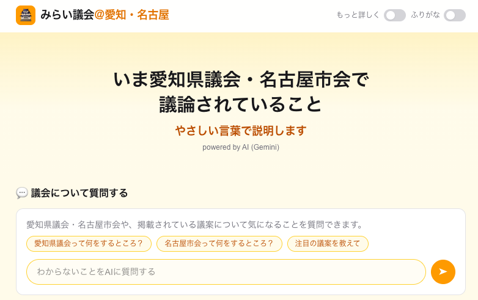
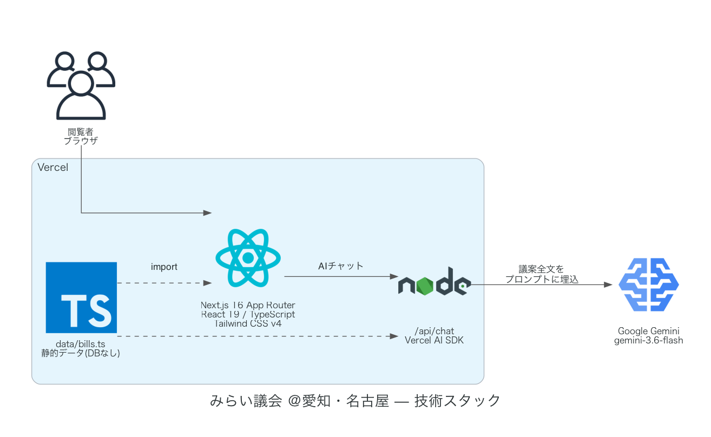

# みらい議会 ＠愛知・名古屋

愛知県議会・名古屋市会で審議された議案を、専門用語なしでわかりやすく伝える個人制作のサイトです。
政党チームみらいが運営しているものではない、非公式のサイトです。

## 特徴

- **議案を10件掲載**: 愛知県議会・名古屋市会それぞれ5件。会議録検索で実際に個別審査が確認できた
  議案(予算案・新設条例・修正可決案など)を選定
- **かんたん解説 / くわしい解説**: ヘッダーのスイッチで表示を切り替え
- **ふりがな表示**: ヘッダーのスイッチでON/OFF。漢字部分だけにルビを振る(送り仮名には振らない)
- **みらい議会を参考にした詳細セクション**: 🎯この法律のポイント / ✏️この法律が必要な理由 /
  👀意見が分かれるところ / 🙋影響を受ける人
- **AIチャット**: Gemini(`gemini-3.6-flash`)による質問応答。トップページは全議案を横断した一般
  質問、議案詳細ページはその議案に絞った質問に対応
- **サムネイル**: 議案ごとに自作イラスト、またはキーワード連動の関連写真を表示

## 使っているデータ

議案データはDBを持たず、`data/bills.ts` に静的データとして手打ちで管理しています。

> **議案の自動更新機能はまだありません。** 掲載している議案は手作業で追加した時点のもので、
> 各議会の最新の議案が自動で反映されることはありません。最新の審議状況は各議会の公式サイトを
> 確認してください。

| 議会 | 議案一覧 | 会議録検索 |
|---|---|---|
| 名古屋市会 | [市会の議案一覧](https://www.city.nagoya.jp/shikai/shingi/1030858/1030859/1046530.html) | [kaigiroku.net](https://ssp.kaigiroku.net/tenant/nagoya/SpTop.html) |
| 愛知県議会 | [議案・結果概要一覧](https://www.pref.aichi.jp/site/gikai/kekka-gaiyo.html) | [pref.aichi.dbsr.jp](https://www.pref.aichi.dbsr.jp/) |

議案一覧の件名を会議録検索にそのままキーワードとして検索し、実際にヒットする(≒個別に審査・
議決された)議案を選んでいます。予算の詳細な内訳や条例の細かい運用ルールなど公式資料でしか
確認できない部分は断定を避け、出典を見るよう案内する書き方にしています。

## アーキテクチャ

## 今後の展望: 最新議案の自動取得

現在は議案を手作業で追加していますが、以下の流れで自動化することを考えています。

1. **議案一覧の取得**: 各議会の議案一覧ページ(上表)をスクレイピングし、議案番号・議案名・
   付託委員会・議決結果を取り出す。両議会ともAPIは提供されておらず、議案ごとの個別ページも
   無いため、定例会ごとの一覧表(HTML)を解析することになる
2. **会議録との突き合わせ**: 取得した議案名をそのままキーワードとして会議録検索
   (kaigiroku.net / pref.aichi.dbsr.jp)にかけ、発言記録を取得する
3. **掲載対象の絞り込み**: 検索がヒットしなかった議案は落とす。軽微な条例の一部改正案などは
   一括上程・一括採決されて個別の発言記録が残らず、解説を書く材料が無いため
4. **解説文の生成**: 集めた発言記録をもとに、`summaryEasy` / `summaryDetailed` や詳細セクション
   をLLMで生成する
5. **ふりがなの再生成**: `npm run generate:furigana` を実行し、生成された解説文にルビを振る
6. **反映**: 生成結果を `data/bills.ts` に追記してコミット・デプロイする(GitHub Actionsの
   定期実行でPRを作る形を想定)

### 課題

- **生成内容の正確性**: 議案の解説は誤りが実害につながりやすく、LLMの生成結果をそのまま無検査で
  公開するのは避けたい。人によるレビューを挟む前提(自動PR → 目視確認 → マージ)にする必要がある
- **スクレイピングの安定性**: 公式サイトのHTML構造やURLは改編されることがあり、追従が必要
- **相手サイトへの負荷**: 定例会は年に数回しか開かれないため、実行頻度は日次以下で十分。
  アクセス間隔を空け、各サイトの利用規約・robots.txt を確認したうえで実装する

## 免責事項

本サイトの情報は、公式に公開されている議案一覧・会議録をもとに作成していますが、正確性・完全性・
即時性を保証するものではありません。AIチャットも不正確な回答を生成する可能性があります。正確な
情報は各議会の公式サイト・一次資料を確認してください。
